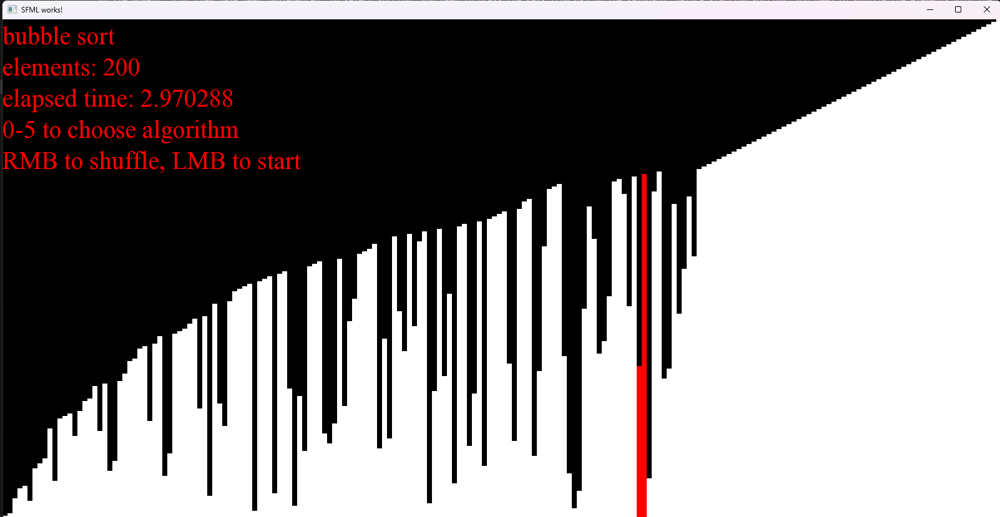
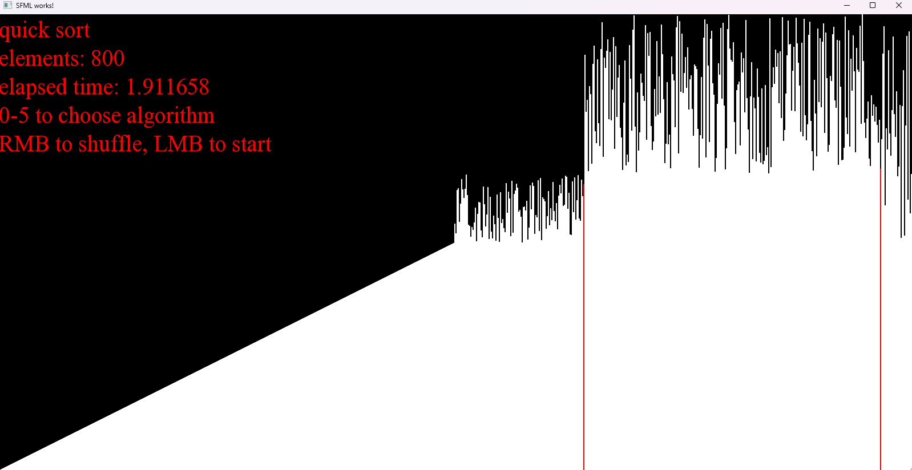

### Visualization of sorting algorithms
This project shows how long different sorts take.
At the moment, 5 of them have been implemented. To select sorting, you need to press the keys from 0-5 on the keyboard, before starting sorting, you need to shuffle the elements with the left mouse button, then click the right mouse button to start sorting.
### Screenshots
#### Bubble sort

#### Quick sort

